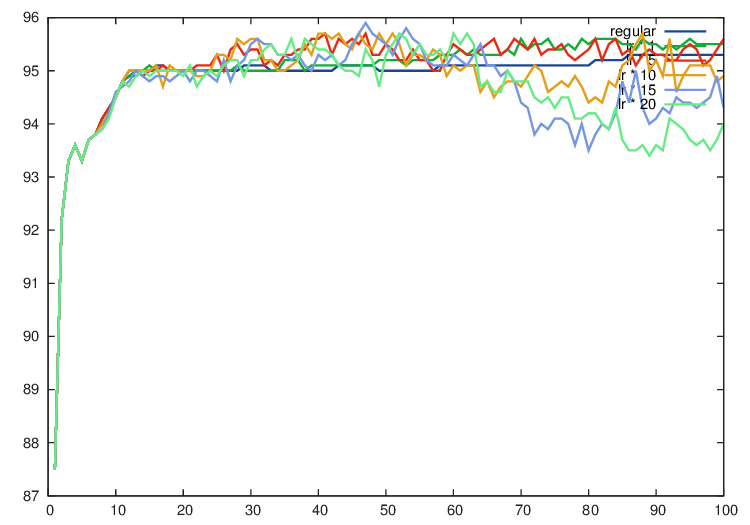
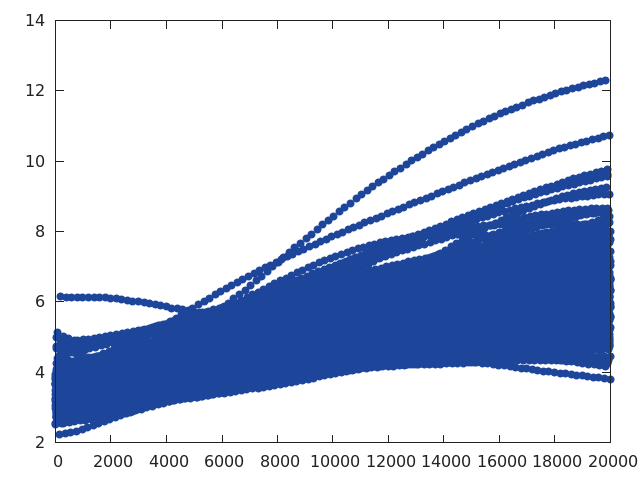
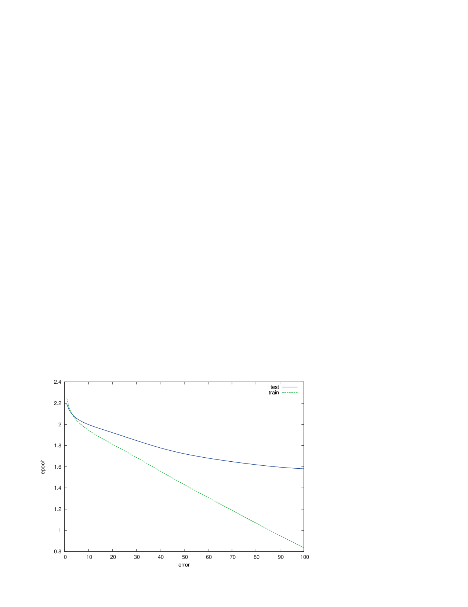
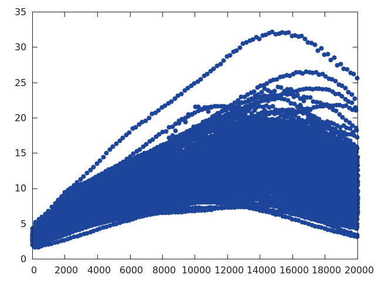
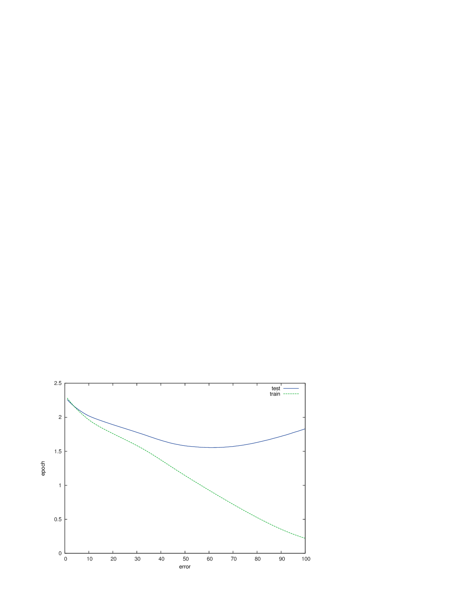
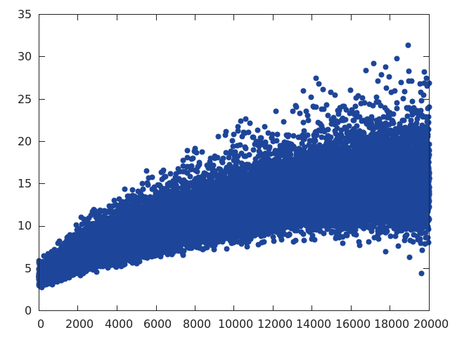
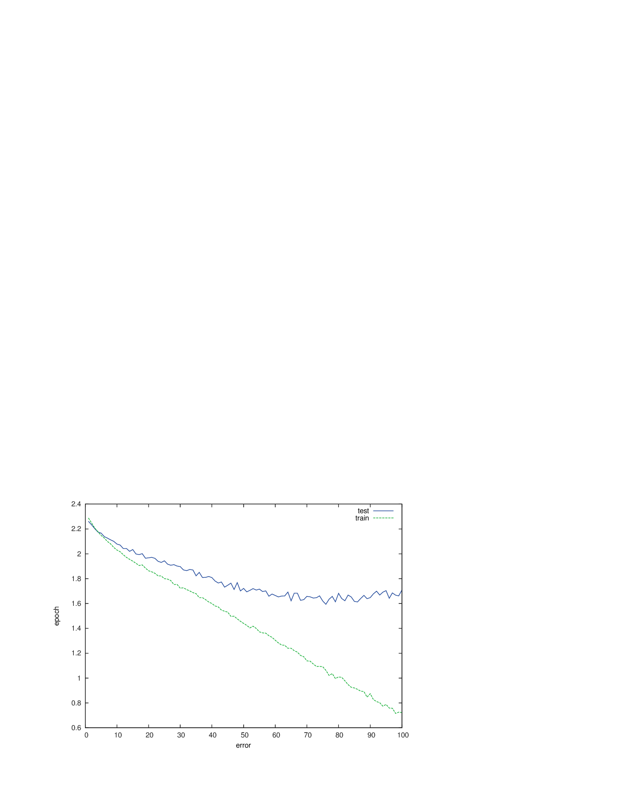
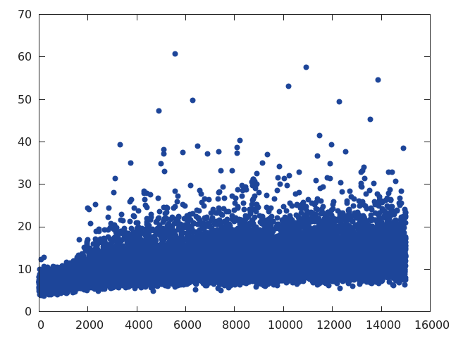

#2016/03/16 Meeting 01

The plot for MNIST : modified algorithm (blue)  v.s. regular gradient descent (green). 
Note: this is based on the reduced dataset (2000 samples). The full dataset contains 60000 samples. 

(the plot can be reproduced by /Users/yutaro/Research/spring2016/Hessian/results/2016-03-17/for-meeting/plot.lua)

#2016/03/21 Meeting 02

## MNIST

1. Parameter Experiment 

(the plot can be reproduced by /Users/yutaro/Research/spring2016/Hessian/results/2016-03-19/plot_para_experiment.lua (with some modification of the input))

2. 

## CIFAR-10

1. Haven't found the right setting for the norm of the gradient to converge. 

(Setting 1 -- 4 uses only 2000 data samples.)
(For all the settings, I used:

> learningRate : 0.001
> batchSize : 10
> hessianMultiplier : 5
)

- Setting 1 : No preprocessing. default model (2 conv and 1 fully connected)

x-axis: the number of parameter update
y-axis: the norm of gradient

- Setting 2: With preprocessing. default model.

> plot for test error

- Setting 3: With preprocessing. model with ReLU.

> plot for test error

- Setting 4: With preprocessing. model with ReLU and Dropout.

> plot for test error

- Setting 5: Full sample

