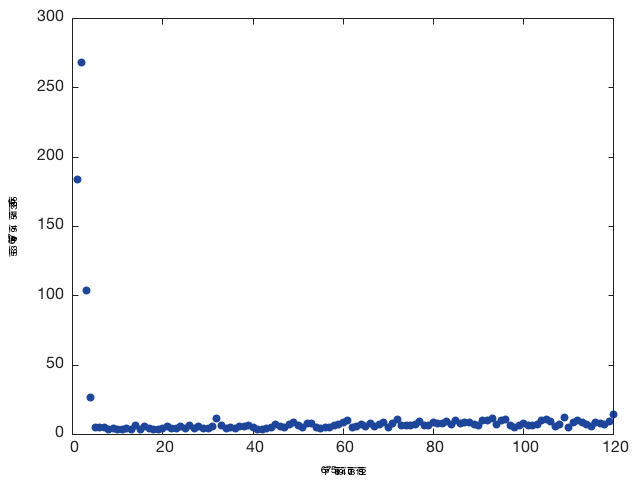

#2016/03/16 Meeting 01

The plot for MNIST : modified algorithm (blue)  v.s. regular gradient descent (green). 
Note: this is based on the reduced dataset (2000 samples). The full dataset contains 60000 samples. 

(the plot can be reproduced by /Users/yutaro/Research/spring2016/Hessian/results/2016-03-17/for-meeting/plot.lua)

(the original data of hessian mode is from /Users/yutaro/Research/spring2016/Hessian/results/2016-03-17/exp-output-2016-03-18-19:11:26/

#2016/03/21 Meeting 02

## MNIST

1. Negative Eigenvalues v.s. Epoch

The blue dot : accuracy per epoch (I had to use a dot-representation in order to plot accuracy v.s. epoch and the negative eigenvalues v.s. minibatches at the same time.)

The green dot : represents either a), b), c), or d) case (described below)

The number of the case which...

- a)The norm of gradient is close to zero: 26728 / 90000 (90000 is the number of total parameter updates) 

- b)The second test passed (L > M): 26672 / 90000

- c)The cost function decreases:  12531 / 90000 

- d)The cost function increases: 14141 / 90000

Comment: 

- a) and b) tells us that for full mnist, whenever the norm of gradient is close to zero, the algorithm is actually near a saddle point instead of a local minimum. 

- c) and d) tells us that more than half of the time, the algorithm increases the loss, instead of decreasing it. The stepsize might be too big...? I need to look into this more. (Note: "learningRate*5, which I used for this experiment, was chosen based on the result of parameter experiment below; learningRate * 5 seems the best choice based on the test accuracy.)
    

2. Parameter Experiment 

(the plot can be reproduced by /Users/yutaro/Research/spring2016/Hessian/results/2016-03-19/plot_para_experiment.lua (with some modification of the input))

3. Full sample plot  

(I stopped the regular one after 10 epochs because this was a sanity check and it keeps having better accuracy than the hessian mode)

This means that I need to tune the stepsize for full dataset as well. (cannot rely on the info from the reduced dataset (2000 data sample set)

## CIFAR-10

1. Haven't found the right setting for the norm of the gradient to converge. 

(Setting 1 -- 4 uses only 2000 data samples.)
(For all the settings, I used:

> learningRate : 0.001
> batchSize : 10
> hessianMultiplier : 5
)

- Setting 1 : No preprocessing. default model (2 conv and 1 fully connected)

x-axis: the number of parameter update
y-axis: the norm of gradient

- Setting 2: With preprocessing. default model.

> plot for test error

- Setting 3: With preprocessing. model with ReLU.

> plot for test error

- Setting 4: With preprocessing. model with ReLU and Dropout.

> plot for test error

- Setting 5: Full sample

#2016/03/23 Meeting 03

## The norm of gradient in CIFAR-10 with different minibatch size

This experiment shows how the norm of gradient will be accurate as I increase the size of minibatch in CIFAR-10. The following plots show that the norm of gradient gets close to zero as the training goes on. All the results can be reproduced at 

The default setting is the following:

>   learningRate : 0.001
>   batchSize : 256 
>   hessianMultiplier : 5 
>   hessian : false
>   preprocess : false
>   gradnormThresh : 0.01
>   modelpath : "/models/train-cifar-model.lua"
>   full : false
>   maxEpoch : 10 

### batchsize 256; train-cifar-model.lua

Title: The norm of gradient 

Title: Accuracy v.s. epoch

### batchsize 512; train-cifar-model.lua

Title: The norm of gradient 

Title: Accuracy v.s. epoch

### batchsize 512; adding dropout and ReLU to the default model

Title: The norm of gradient 

Title: Accuracy v.s. epoch

### batchsize 512; adding only ReLU (this is the best one)

Title: The norm of gradient 

Title: Accuracy v.s. epoch

### batchsize 2000; adding only ReLU 

Title: The norm of gradient 

Title: Accuracy v.s. epoch

## Line Search Test

This experiment compares the accuracy between line-search and constant*learningRate after 100 epochs, using the 2000 data samples of MNIST, where constant = 1 in this experiment.  

### Sanity check

The following confirms that the line search actually decreases the cost each time. (comparison between c) and d).

The comparison between a) and b) confirms that we are at saddle points most of the time. (existence of at least one negative eigenvalue when the gradient threshold passed.)

The number of the case in which...

- a)The norm of gradient is close to zero: 2832 / 20000 (20000 is the number of total parameter updates) 

- b)The second test passed (L > M): 2827 / 20000

- c)The cost function decreases:  2827 / 20000 

- d)The cost function increases: 0 / 20000

### Plot

To do: generate the plot that compares this with the regular one

> command 
> th ../../../src/plot_table.lua -xlabel "epoch" -ylabel "accuracy" -input1 baseline-100epoch-output-2016-03-22-04\:56\:28/logs/test.csv  -input2 linesearch-100epoch-output-2016-03-22-04\:19\:57/logs/test.csv -epochCompareTestAcc -name "plot.eps" -compareName1 "baseline" -compareName2 "linesearch"
> convert -density 150 plot.eps hoge.png
> convert hoge.png -background white -flatten -alpha off plot.png

